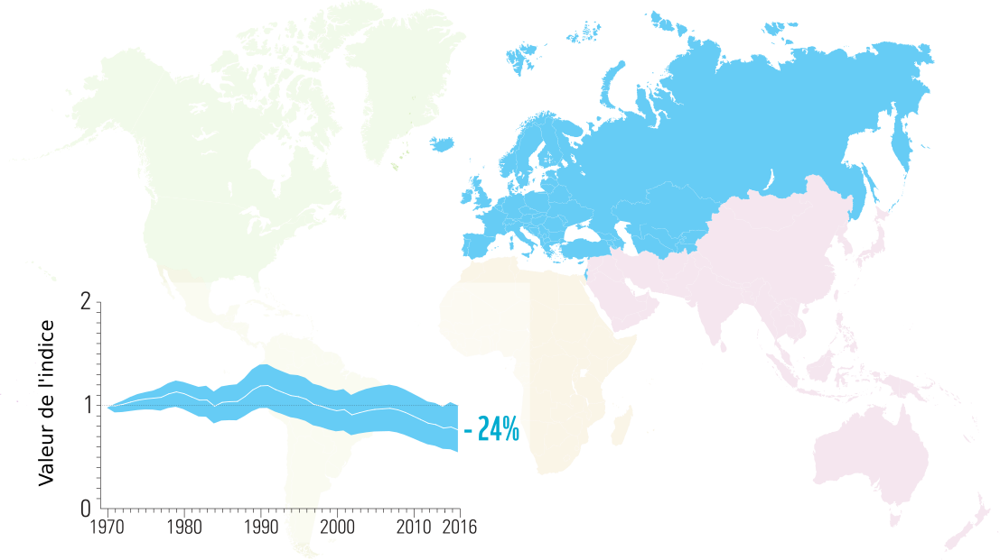
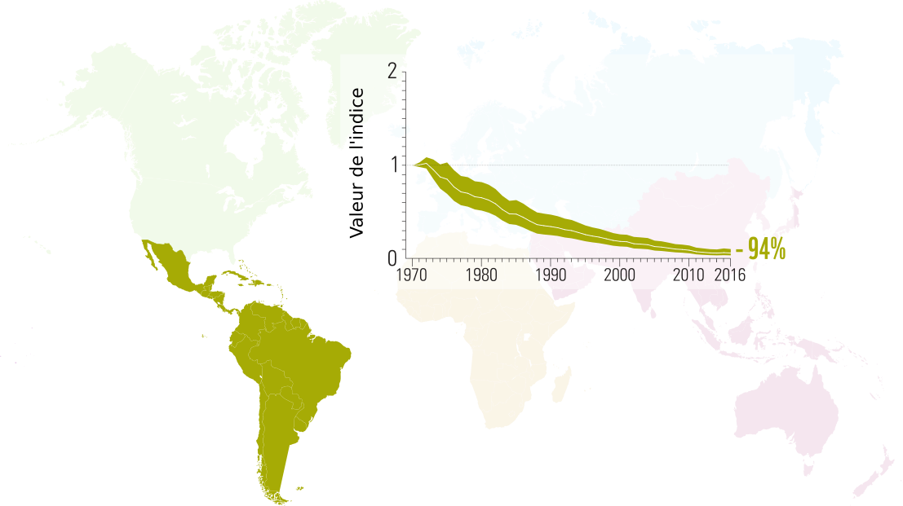
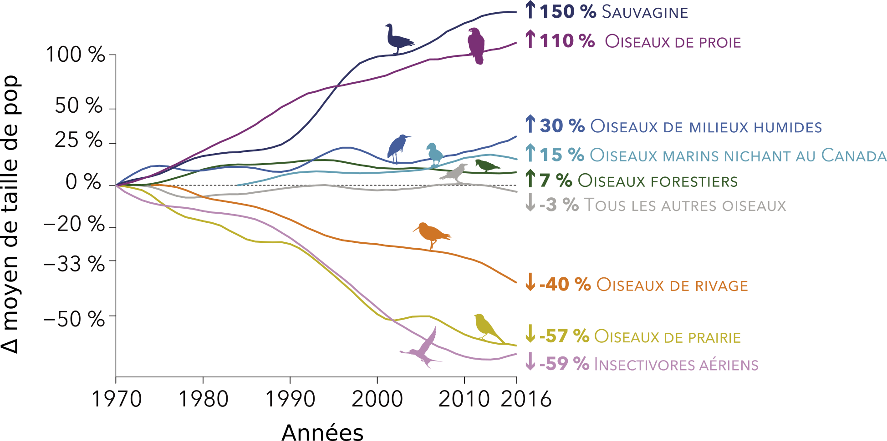

```{r setup, echo = F}
knitr::opts_chunk$set(
  comment = "#",
  #cache = TRUE,
  collapse = TRUE,
  warning = FALSE,
  message = FALSE,
  fig.width = 7,
  fig.height = 5.25,
  fig.align = 'center',
  fig.retina = 3
)

# base plot layout
mypar = list(mar = c(3,3,0.5,0.5), mgp = c(1.5, 0.3, 0), tck = -.008)

# xaringan Extra
xaringanExtra::use_xaringan_extra(c("tile_view", "animate_css", "tachyons"))
xaringanExtra::use_extra_styles(
  hover_code_line = TRUE,         #<<
  mute_unhighlighted_code = TRUE  #<<
)
xaringanExtra::use_editable(expires = 1)
xaringanExtra::use_panelset()
```
class: middle, title-slide

<!-- top logo (comment to remove or edit on `conf/css/style.css:23`) -->
<div class="lab-logo"></div>
<div class="uni-logo"></div>

# Indice Distribution Biodiversité

<hr width="60%" align="left" size="0.3" color="orange"></hr>

## Suivre les changements d'aire <br/> de distribution au fil du temps

### Vincent Bellavance, .small[Étudiant à la maîtrise]

<div class="birds" >Photo by <a href="https://unsplash.com/@patriceb?utm_source=unsplash&utm_medium=referral&utm_content=creditCopyText" class="link_birds" >Patrice Bouchard</a> on <a style="font-size:10px;" href="https://unsplash.com/?utm_source=unsplash&utm_medium=referral&utm_content=creditCopyText" class="link_birds">Unsplash</a></div>
  


<br><br>
[<i class="fa fa-github fa-lg" style="color:#e7e8e2"></i> VincentBellavance/seminar2](https://github.com/VincentBellavance/seminar2)

[<i class="fa fa-twitter fa-lg" style="color:#e7e8e2"></i> @v_bellavance](https://twitter.com/v_bellavance)


---
# Changements de biodiversité
<hr width="100%" align="left" size="0.3" color="#33638d"></hr>

--

.pull-left[
  
]

--

.pull-right[
  
]

---
# Changements de biodiversité
<hr width="100%" align="left" size="0.3" color="#33638d"></hr>

<br>

.pull-left[
.font120[**Terrestres:**]

.font120[
- L'utilisation du territoire:
  - Agriculture
  - Foresterie
  - Urbanisation
]

.font120[**Marins:**]

- .font120[La surpêche]
]

--

.pull-right[
.font120[**Déclins:**]

.font120[
- Destruction d’habitats
- Surexploitation
- Pollution
- Introduction d’espèces exotiques
- Changements climatiques
]
]

???

La production de ces deux rapports a accéléré le développement d'indicateurs de biodiversité entamé lors des deux dernières décennies.

---

# Les indicateurs de biodiversité
<hr width="100%" align="left" size="0.3" color="#33638d"></hr>

<br>

.center[
  
]

???

Les indicateurs font parties des outils qui servent à mesurer les changements de biodiversité.

---

# Les indicateurs de biodiversité
<hr width="100%" align="left" size="0.3" color="#33638d"></hr>

<br>

.center[
  
]

???

Ils servent à représenter les changements de manière simplifiée

---

# Les indicateurs de biodiversité
<hr width="100%" align="left" size="0.3" color="#33638d"></hr>

<br>

.pull-left1[
  .center2[
    <br>
    
  ]
]

.pull-right1[
.font120[
- Compréhensible

<br>
- Communicable

<br>
- Mesure précise

]
]

???

Ils servent à représenter les changements de manière simplifiée

---

# Développement d'indicateurs
<hr width="100%" align="left" size="0.3" color="#33638d"></hr>

.pull-left[
  <br><br>
  .center2[
    
  ]
]

--

.pull-right[
  <br>
  
]

???

Un indicateur peut représenter plusieurs thèmes. Le thème ayant le plus développé en terme de nombre d'indicateurs est définitivement celui des espèces. 

---

# Indice Planète Vivante
<hr width="100%" align="left" size="0.3" color="#33638d"></hr>

.font120[
- Mesure le changement moyen de la taille des populations de vertébrés depuis 1970
]

--

.font120[
- Utilise les suivis de population à long terme:
  - Mesure **directe ou indirecte** 
  - Sur **plusieurs années** 
  - **Même méthodologie** pour une population
]

--

.font120[
- Peut-être calculer **globalement**, pour une **région précise** ou pour un **groupe taxonomique**
]

---
# Méthodes du LPI


---

# Les indicateurs à l'échelle globale
<hr width="100%" align="left" size="0.3" color="#33638d"></hr>

.font120[**Indice planète vivante**]

.center[
  
]

.cite[WWF [2020]]

???

Dans le dernier rapport de l'Indice Planète Vivante, il est rapporté que la taille moyenne des populations de vertébrés à travers le monde a diminué de 68%

Ils ont également calculé l'indice selon des grandes régions et il y a une grande variabilité de l'indicateur entre les différentes régions.

---

# Les indicateurs à l'échelle globale
<hr width="100%" align="left" size="0.3" color="#33638d"></hr>

<br>

.center[
  
]

.cite[WWF [2020]]

---

# Les indicateurs à l'échelle globale
<hr width="100%" align="left" size="0.3" color="#33638d"></hr>

<br>

.center[
  
]

.cite[WWF [2020]]

---

# Les indicateurs à l'échelle globale
<hr width="100%" align="left" size="0.3" color="#33638d"></hr>

<br>

- .font180[Déclin globale]

???

Donc, le message du rapport du LPI est qu'il y a un fort déclin des populations de vertébrés dans le monde

--

<br>

- .font180[Mais...]

???

Mais, il y a quelques articles qui viennent nuancer le message du rapport de l'Indice Planète Vivante.

---

# Les indicateurs à l'échelle globale
<hr width="100%" align="left" size="0.3" color="#33638d"></hr>

<br>

.center[
  
]

.cite[Dornelas et al. [2019] Ecol. Lett]

???

Dornelas et collaborateur en 2019. Avec le même jeu de données que le LPI, ils ont vu que 85% des populations ont un taux de croissance nul. Le reste des 15% sont en croissance ou en décroissance de manière égale. Au final, Pas de changement net.

---

# Les indicateurs à l'échelle globale
<hr width="100%" align="left" size="0.3" color="#33638d"></hr>

<br>

.center[
  
]

.cite[Leung et al. [2020] Nature]

???

Le grand déclin obtenu avec le LPI n'est en fait que le résultat de quelques populations dont le déclin est extrême. Lorsqu'on retire ces populations, l'indice tourne autour de 1.

---

# Les indicateurs à l'échelle globale
<hr width="100%" align="left" size="0.3" color="#33638d"></hr>

<br>

.font150[Message plus **nuancé**:]

- .font150[**Grande variabilité** dans les **régions** et les groupes **taxonomiques**]

---

# Les indicateurs à l'échelle globale
<hr width="100%" align="left" size="0.3" color="#33638d"></hr>

<br>

- .font150[Biodiversité **diminue**, mais **difficile** de faire un **portrait global**]

???

Les scientifiques s'entendent généralement pour dire que la biodiversité à l'échelle globale diminue. C'est toutefois difficile de faire un portrait global en tenant compte de toute la variabilité dans ces changements.

--

<br>

- .font150[Les **suivis nationaux** sont nécessaires]

???

Les suivis nationaux sont donc nécessaires puisque ça permet d'avoir une idée plus précise de l'état de la biodiversité dans un pays. C'est très important puisque c'est les pays qui vont adopter les politiques de conservation.

---

# Les indicateurs au Canada
<hr width="100%" align="left" size="0.3" color="#33638d"></hr>

.font120[**Indice planète vivante**]

<br>

.center[
  
]

.cite[WWF Canada [2020]]

---

# Les indicateurs au Canada
<hr width="100%" align="left" size="0.3" color="#33638d"></hr>

.font120[**Indice des espèces canadiennes**]

<br>

.center[
  
]

.cite[Environnement Canada [2019]]

---

# Les indicateurs au Canada
<hr width="100%" align="left" size="0.3" color="#33638d"></hr>

.font120[**États des oiseaux du Canada (2019)**]

<br>

.center[
  
]

.cite[IOCAN [2019]]

???

Initiative de conservations des oiseaux de l'Amérique du Nord

Le Canada a plusieurs indicateurs de biodiversité et on peut voir que les changements de biodiversité documenté par les indicateurs sont très différents de ceux à l'échelle globale. Par contre, si on veut avoir une idée de l'état de la biodiversité à l'échelle de la province, on ne peut pas nécessairement les utiliser puisqu'il y a également une grande variabilité dans les changements de biodiversité.

---

# Les suivis de biodiversité au Québec
<hr width="100%" align="left" size="0.3" color="#33638d"></hr>

- .font120[**Aucun suivi** de biodiversité à **long terme**]

--

- .font120[Centre de données sur le patrimoine naturel du Québec : **espèces à statut**]

--

- .font120[Manque de données (e.g. **suivis à long terme de populations**)]

--

- .font120[Orientation du gouvernement]

  >.font120[**Évaluation** de la **biodiversité** et **élaboration** d’un **réseau de suivi**]

???

C'est important d'avoir ce genre de suivi, surtout que l'évaluation de la biodiversité et l'élaboration d'un réseau de suivi de la biodiversité fait partie des orientation du gouvernement en matière de biodiversité. 

---

# Questions
<hr width="100%" align="left" size="0.3" color="#33638d"></hr>
<br>

> .font110[Quels sont les **changements de biodiversité au Québec** dans les **dernières décennies**?]

<br>

--

<br>

> .font110[Est-il possible de développer un **indice** utilisant les **données d'occurrence et d'abondance** disponibles?]

---

# Objectifs
<hr width="100%" align="left" size="0.3" color="#33638d"></hr>
<br>
.font110[Objectif général:]
<br><br>
> **.font120[.center[Développer un indice de changement de biodiversité basé sur les changements de distribution des espèces]]**

<br><br>
--

.font110[Objectif secondaire:]
<br><br>
>**.font120[.center[Développer le pipeline qui permettra d'automatiser le calcul de l'indice avec la base de données ATLAS et de représenter le résultat au moyen d'un outil web interactif]]**

---
# Indice Distribution Biodiversité

## Pipeline

---
# Indice Distribution Biodiversité

## Méthode: Données

---
# Indice Distribution Biodiversité

## Méthode: Aires de distribution

---
# Indice Distribution Biodiversité

## Méthode: Calcul de l'indice

---
# Indice Distribution Biodiversité

## Interprétation des résultats

---
# Indice Distribution Biodiversité

## Limites

---
# Conclusion et contributions
