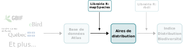
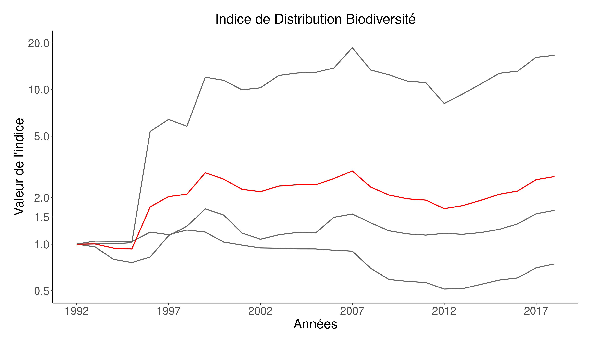

```{r setup, echo = F}
knitr::opts_chunk$set(
  comment = "#",
  #cache = TRUE,
  collapse = TRUE,
  warning = FALSE,
  message = FALSE,
  fig.width = 7,
  fig.height = 5.25,
  fig.align = 'center',
  fig.retina = 3
)

# base plot layout
mypar = list(mar = c(3,3,0.5,0.5), mgp = c(1.5, 0.3, 0), tck = -.008)

# xaringan Extra
xaringanExtra::use_xaringan_extra(c("tile_view", "animate_css", "tachyons"))
xaringanExtra::use_extra_styles(
  hover_code_line = TRUE,         #<<
  mute_unhighlighted_code = TRUE  #<<
)
xaringanExtra::use_editable(expires = 1)
xaringanExtra::use_panelset()
```
class: middle, title-slide

<!-- top logo (comment to remove or edit on `conf/css/style.css:23`) -->
<div class="lab-logo"></div>
<div class="uni-logo"></div>

# Indice de Distribution de Biodiversité

<hr width="60%" align="left" size="1" color="orange"></hr>

## Suivre les changements des aires <br/> de distribution des espèces du Québec dans le temps

### Vincent Bellavance, .small[étudiant à la maîtrise]

<div class="birds" >Photo by <a href="https://unsplash.com/@patriceb?utm_source=unsplash&utm_medium=referral&utm_content=creditCopyText" class="link_birds" >Patrice Bouchard</a> on <a style="font-size:10px;" href="https://unsplash.com/?utm_source=unsplash&utm_medium=referral&utm_content=creditCopyText" class="link_birds">Unsplash</a></div>
  


<br>
[<i class="fa fa-github fa-lg" style="color:#e7e8e2"></i> VincentBellavance/seminar2](https://github.com/VincentBellavance/seminar2)

[<i class="fa fa-twitter fa-lg" style="color:#e7e8e2"></i> @v_bellavance](https://twitter.com/v_bellavance)

---

# Changements de biodiversité
<hr width="100%" align="left" size="1" color="orange"></hr>

.pull-left[
  
]

.cite[CBD 2020]

<br><br>

.pull-right[
.font120[
- Parties de la **Convention** sur la **Diversité Biologique**
- 160 pays signataires
- 196 parties
- Vise la conservation de la biodiversité.
]
]

---

# Changements de biodiversité
<hr width="100%" align="left" size="1" color="orange"></hr>

.pull-left[
  
]

<br><br>

.pull-right[
  
]

.cite[CBD 2020]

???

---

# Changements de biodiversité
<hr width="100%" align="left" size="1" color="orange"></hr>

.pull-left[
  
]

<br><br>

.pull-right[
  
]

.cite[CBD 2020]

???

L'écriture de ces rapports ont amené beaucoup de chercheurs dans les dernières 15 années à développer des outils permettant de mesurer et visualiser les changements de biodiversité

---
# Les indicateurs de biodiversité
<hr width="100%" align="left" size="1" color="orange"></hr>

<br>

.center[
  
]

???

Mesurent des changements complexes et les représenter de manière simplifiée

---

# Les indicateurs de biodiversité
<hr width="100%" align="left" size="1" color="orange"></hr>

<br>

.center[
  
]

???

---

# Les indicateurs de biodiversité
<hr width="100%" align="left" size="1" color="orange"></hr>

<br>

.pull-left1[
  .center2[
    <br>
    
  ]
]

.pull-right1[
.font120[
- Compréhensible

<br>
- Communicable

<br>
- Mesure précise

]
]

???

Compréhensible pour les décideurs et le grand public (sert à vérififer l'atteinte d'objectifs et de sensibiliser).

Un des indicateurs les plus connus et les plus utilisés est sans aucun doute l'Indice Planète Vivante

---

# Indice Planète Vivante
<hr width="100%" align="left" size="1" color="orange"></hr>

.font120[
- Mesure le changement moyen de la taille des populations de vertébrés depuis 1970
]

.cite[Collen et al. 2009 Conserv. Biol.]

--

.font120[
- Utilise les suivis de population à long terme:
  - Mesure d'abondance d'une population au fil des ans
]

--

.font120[
- Peut-être calculé **globalement**, pour une **région précise** ou pour un **groupe taxonomique**
]

---

# Indice Planète Vivante
<hr width="100%" align="left" size="1" color="orange"></hr>

<br>

.center[
  
]

.cite[WWF 2020]

???

Ici, figure du dernier rapport. Cette figure représente la diminution moyenne de la taille de population des vertébrés sur lequel on a des données. 

---

# Indice des espèces canadiennes
<hr width="100%" align="left" size="1" color="orange"></hr>

.font120[**Environnement Canada**]

<br>

.center[
  
]

.cite[Environnement Canada [2019]]

???

Le développement de ces indices fait partie des engagements du Canada en matière de protection de la biodiversité

---

# Les suivis de biodiversité au Québec
<hr width="100%" align="left" size="1" color="orange"></hr>

<br>

- .font120[Orientations gouvernementales en matière de diversité biologique]

>.font120[**Évaluation** de la **biodiversité** et **élaboration** d’un **réseau de suivi**]

--

.center[
  
]

???

Présentement: Développement de Biodiversité Québec. Il n'existe aucun indicateur. 

---

# Les suivis de biodiversité au Québec
<hr width="100%" align="left" size="1" color="orange"></hr>

.pull-left[
  
]

<br>

.pull-right[
  
]

.cite[Berteaux et al. 2018 Sci. Rep.]

???

On s'attend à avoir des déplacements d'espèces provenant du sud.

Ces changements se produisent dans l'espace, prend un indicateur qui permet cette visulisation dans l'espace.

---

# Les suivis de biodiversité au Québec
<hr width="100%" align="left" size="1" color="orange"></hr>

<br>

.pull-left[
  
]

.pull-right[
.font120[
- On ne peut pas extrapoler dans l'espace

- Peu de suivis de population à long terme
]
]

---

# Objectifs
<hr width="100%" align="left" size="1" color="orange"></hr>

<br>

>.font120[
  .center[**Développer un indicateur de changements de biodiversité basé sur les données d'occurrences**]
]

--

<br>

>.font120[
  .center[**Documenter les changements d'aires de distribution des espèces d'oiseaux présentes au Québec**]
]

<br>

>.font120[
  .center[**Comparer les changements d'aires de distribution de divers groupes fonctionnels d'oiseaux du Québec**]
]

---

class: middle, center, inverse

# Méthodes
<hr width="100%" align="left" size="1" color="orange"></hr>

---

# Méthodes
<hr width="100%" align="left" size="1" color="orange"></hr>

.center[
  
]

---

# Méthodes
<hr width="100%" align="left" size="1" color="orange"></hr>

.center[
  
]

---

# Méthodes
<hr width="100%" align="left" size="1" color="orange"></hr>

.center[
  
]

???

Explication du SDM: La Québec est divisé en grille avec des cellules d'une taille égale. On obtient une probabilité d'occurrence pour chaque cellule. 

---

# Méthodes
<hr width="100%" align="left" size="1" color="orange"></hr>

.center[
  
]

---

# Méthodes
<hr width="100%" align="left" size="1" color="orange"></hr>

.center[
  
]

---

# Méthodes
<hr width="100%" align="left" size="1" color="orange"></hr>

.center[
  
]

---

# Méthodes
<hr width="100%" align="left" size="1" color="orange"></hr>

.center[]

---

# Méthodes
<hr width="100%" align="left" size="1" color="orange"></hr>

.center[]

???

Base de données commencé en 2019, toujours en développement, notamment pour ce qui est de la validation des données et de la taxonomie, et de l'injection de données. 

---

# Méthodes
<hr width="100%" align="left" size="1" color="orange"></hr>

.center[]

.div-top[
.font120[
  - **Standard d'informations** pour les observations sur la biodiversité au Québec
]

.font120[
- Proviennent de **plusieurs sources**:
  - Gouvernementales
  - Bases de données ouvertes (e.g. GBIF)
  - Science citoyenne (e.g. eBird)
]

.font120[
  - 130 millions d'occurrences de centaines d'espèces
]
]

---

# Méthodes
<hr width="100%" align="left" size="1" color="orange"></hr>

.center[]

---

# Méthodes
<hr width="100%" align="left" size="1" color="orange"></hr>

.center[
  
]

.center[
  
]

---

# Méthodes
<hr width="100%" align="left" size="1" color="orange"></hr>

.center[
  
]

.center[
  
]

---

# Méthodes
<hr width="100%" align="left" size="1" color="orange"></hr>

.center[
  
]

.pull-left-top[
.font120[
- eBird
  
- Atlas des Oiseaux Nicheurs

- Relevé des Oiseaux Nicheurs
]
]

.pull-right[
  
]

---

# Méthodes
<hr width="100%" align="left" size="1" color="orange"></hr>

.center[
  
]

.pull-left-top[
.font120[
- Environ **huit millions** de points d'échantillonnages **exhaustifs**

- Moyenne de **260000 points/année**

- **282 espèces** d'oiseaux **nicheurs** du Québec
]
]

.pull-right[
  
]

---

# Méthodes
<hr width="100%" align="left" size="1" color="orange"></hr>

.center[
  
]

.center[
  
]

---

# Méthodes
<hr width="100%" align="left" size="1" color="orange"></hr>

.center[
  
]

.center[
  
]

???

Tout est semblable dans ce cercle, mais les points les plus près sont plus semblables que ceux plus éloignés

---

# Méthodes
<hr width="100%" align="left" size="1" color="orange"></hr>

.center[
  
]

<br>

.center[
  
]

???

Irrégularités d'échantillonnages entre les années, on prend des fenêtres temporelles afin d'obtenir des variations moins abruptes de l'indicateur. 

---

# Méthodes
<hr width="100%" align="left" size="1" color="orange"></hr>

.center[]

???

Pour vous expliquer comment l'indicateur est calculé, je vais passer à travers un exemple avec le Cardinal Rouge

---

# Méthodes
<hr width="100%" align="left" size="1" color="orange"></hr>

.center[]

.div-top[
.center[
  
]
]

---

# Méthodes
<hr width="100%" align="left" size="1" color="orange"></hr>

.center[]

.div-top[
.center[
  
]
]

---

# Méthodes
<hr width="100%" align="left" size="1" color="orange"></hr>

.center[]

.div-top[
  .center[
    
  ]
]

---

# Méthodes
<hr width="100%" align="left" size="1" color="orange"></hr>

.center[]

.div-top[
#### Augmentation des aires de distribution
]

.div-top[
.center[
.pull-left-margin[
  
]

<br>

.pull-right[
  .font120[Augmentation de 11% de l'aire de la cellule]
]
]
]

---

# Méthodes
<hr width="100%" align="left" size="1" color="orange"></hr>

.center[]

.div-top[
#### Réductions des aires de distribution
]

.div-top[
.center[
.pull-left-margin[
  
]

<br>

.pull-right[
  .font120[Réduction de 15% de l'aire de la cellule]
]
]
]

???

Ces changements peuvent être visualisés sur une carte, où chaque cellule à une valeur d'augmentation et de diminution. Ou on peut observer ces changements sur une série temporelle

---

# Méthodes
<hr width="100%" align="left" size="1" color="orange"></hr>

.center[]

.div-top[
#### Augmentation et diminution des aires de distribution
]

<br>

.div-top[
Augmentation: $\frac{E_t}{A_{t-1}}, \;\; E_t$ = Somme des augmentations
]

--

<br>

Diminution: $\frac{C_t}{A_{t-1}}, \;\; C_t$ = Somme des réductions

---

# Méthodes
<hr width="100%" align="left" size="1" color="orange"></hr>

.center[]

.div-top[
  .center[
    
  ]
]

---

# Méthodes
<hr width="100%" align="left" size="1" color="orange"></hr>

.center[]

.div-top[
  .center[
    
  ]
]

---

# Méthodes
<hr width="100%" align="left" size="1" color="orange"></hr>

.center[]

.div-top[
  .center[
    
  ]
]

---

class: middle, center, inverse

# Résultats
<hr width="100%" align="left" size="1" color="orange"></hr>

---

# Résultats
<hr width="100%" align="left" size="1" color="orange"></hr>

- 17 espèces:
 
  - 11 **insectivores aériens**
  - 6 **oiseaux de proie**

--

.center[
  
]

.cite[ICOAN 2019]

???

Initiative de conservation des oiseaux de l'amérique du nord

---

# Résultats
<hr width="100%" align="left" size="1" color="orange"></hr>

#### Objectifs: Documenter les changements d'aires de distribution

.center[
  
]

---

# Résultats
<hr width="100%" align="left" size="1" color="orange"></hr>

#### Objectifs: Documenter les changements d'aires de distribution

.pull-left[
  
]

.pull-right[
  
]

---

# Résultats
<hr width="100%" align="left" size="1" color="orange"></hr>

#### Objectifs: Documenter les changements d'aires de distribution

.center[
  
]

---

# Résultats
<hr width="100%" align="left" size="1" color="orange"></hr>

#### Objectifs: Comparer les groupes fonctionnels

.center[
  
]

---

# Résultats
<hr width="100%" align="left" size="1" color="orange"></hr>

.center[
  
]

---

# Résultats
<hr width="100%" align="left" size="1" color="orange"></hr>

.center[
  
]

---

# Résultats
<hr width="100%" align="left" size="1" color="orange"></hr>

.pull-left[
  
]

.pull-right[
  
]

---

# Limites
<hr width="100%" align="left" size="1" color="orange"></hr>

<br>

.font120[
- **Bruit** dans les modèles
]

--

.font120[
  - Pratiquement **aucune information** pour le **nord du Québec**
]

--

.font120[
  - **Aucune incertitude** sur l'indice
]

--

.font120[
  - Données science citoyenne: **nombreux biais**
]

---

# Indicateur de Distribution de Biodiversité
<hr width="100%" align="left" size="1" color="orange"></hr>

#### Objectif principal: Développer un indicateur de changements de biodiversité basé sur les données d'occurrences

.pull-left[
  
]

.pull-right[
.font120[
- Inclusion d'un **plus grand nombre d'espèces**

- **Grande couverture temporelle** pour **chaque espèce**
]
]

---

# Indicateur de Distribution de Biodiversité
<hr width="100%" align="left" size="1" color="orange"></hr>

#### Objectif principal: Développer un indicateur de changements de biodiversité basé sur les données d'occurrences

.pull-left[
.font120[
- Changements dans **l'espace**

- **Augmentations/réductions** d'aires de distribution
]
]

.pull-right[
  
]

---

# Applications potentielles
<hr width="100%" align="left" size="1" color="orange"></hr>

<br>

.font120[
- Corrélations entre **augmentations/réductions** et facteurs **environnementaux** ou **anthropiques**
]

--

<br>

.font120[
- **Prédictions** de l'indice dans le temps

  - Scénarios de **perturbations** ou **d'actions de conservation**
]

---

# Remerciements
<hr width="100%" align="left" size="1" color="orange"></hr>

.pull-left[
.font120[**Superviseur:**]

Dominique Gravel

<br>

.font120[**Comité d’encadrement:**]

Isabelle Laforest-Lapointe

Mark Vellend

<br>

.font120[**Membres du laboratoire Gravel et de Biodiversité Québec**]
]

.pull-right[
  


]

---
# Méthodes du LPI
<hr width="100%" align="left" size="1" color="orange"></hr>

.center[
  
]

.cite[Buschke et al. 2021 Nat. Ecol. Evol.]

---

# Critiques du LPI
<hr width="100%" align="left" size="1" color="orange"></hr>

<br>

.center[
  
]

---

# Critiques du LPI
<hr width="100%" align="left" size="1" color="orange"></hr>

<br>

.center[
  
]

---

# Critiques du LPI
<hr width="100%" align="left" size="1" color="orange"></hr>

<br>

.center[
  
]

---

# Taxonomie du LPI au Québec
<hr width="100%" align="left" size="1" color="orange"></hr>

<br>

.font120[**Mammifères**: 20]

.font120[**Poissons**: 68]

.font120[**Reptiles**: 1]

.font120[**Amphibiens**: 5]

.font120[**Oiseaux**: lon/lat sur centroïde du Canada]


---

# Taxonomie du LPI au Canada
<hr width="100%" align="left" size="1" color="orange"></hr>

<br>

.font120[**Mammifères:** 100 (51%)]

.font120[**Poissons:** 357 (34%)]

.font120[**Herpétofaune:** 37 (43%)]

.font120[**Oiseaux**: 389 (86%)]

---

# Développement d'indicateurs
<hr width="100%" align="left" size="1" color="orange"></hr>

.pull-left[
  <br><br>
  .center2[
    
  ]
]

<br><br>

.pull-right[
.font120[**Biodiversity indicators partnership**]

.font120[
  Approuvée par la Convention sur la Diversité Biologique
]

]

---

# Développement d'indicateurs
<hr width="100%" align="left" size="1" color="orange"></hr>

.pull-left[
  <br><br>
  .center2[
    
  ]
]

.pull-right[
  <br>
  
]

???

Un indicateur peut représenter plusieurs thèmes. Le thème ayant le plus développé en terme de nombre d'indicateurs est définitivement celui des espèces. 

---

# Épervier de Cooper
<hr width="100%" align="left" size="1" color="orange"></hr>

.center[
  
]

---

# Autour des palombes
<hr width="100%" align="left" size="1" color="orange"></hr>

.center[
  
]

---

# Buse à queue rousse
<hr width="100%" align="left" size="1" color="orange"></hr>

.center[
  
]

---

# Urubu à tête rouge
<hr width="100%" align="left" size="1" color="orange"></hr>

.center[
  
]

---

# Faucon pèlerin
<hr width="100%" align="left" size="1" color="orange"></hr>

.center[
  
]

---

# Pygargue à tête blanche
<hr width="100%" align="left" size="1" color="orange"></hr>

.center[
  
]

---

# Changements de biodiversité
<hr width="100%" align="left" size="1" color="orange"></hr>

.pull-left[
  
]

<br><br>

.pull-right[
  .font120[
    **Plateforme intergouvernementale** scientifique et politique sur la **biodiversité** et les **services écosystémiques**
  ]
]

.cite[IPBES 2019]

???

Équivalent pour la biodiversité du Groupe International d'Expert sur le Climat

---

# Changements de biodiversité
<hr width="100%" align="left" size="1" color="orange"></hr>

.pull-left[
  
]

<br><br>

.pull-right[
.font120[**Déclins:**]

.font120[**1 millions** d'espèces menacées d'extinction]
]

.cite[IPBES 2019]

