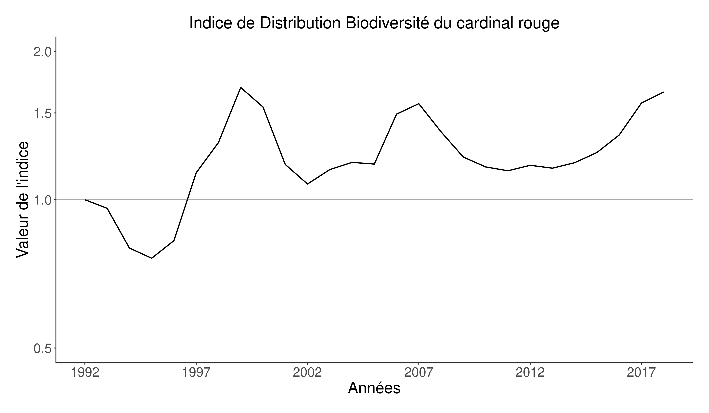
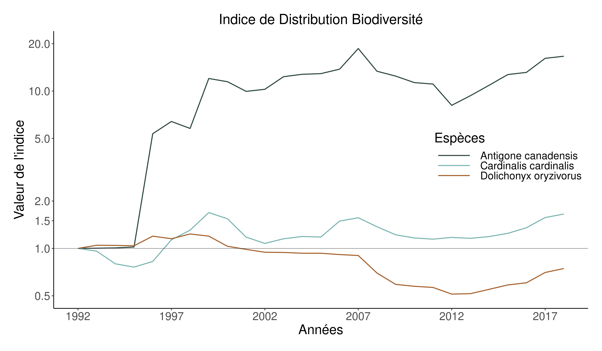

```{r setup, echo = F}
knitr::opts_chunk$set(
  comment = "#",
  #cache = TRUE,
  collapse = TRUE,
  warning = FALSE,
  message = FALSE,
  fig.width = 7,
  fig.height = 5.25,
  fig.align = 'center',
  fig.retina = 3
)

# base plot layout
mypar = list(mar = c(3,3,0.5,0.5), mgp = c(1.5, 0.3, 0), tck = -.008)

# xaringan Extra
xaringanExtra::use_xaringan_extra(c("tile_view", "animate_css", "tachyons"))
xaringanExtra::use_extra_styles(
  hover_code_line = TRUE,         #<<
  mute_unhighlighted_code = TRUE  #<<
)
xaringanExtra::use_editable(expires = 1)
xaringanExtra::use_panelset()
```
class: middle, title-slide

<!-- top logo (comment to remove or edit on `conf/css/style.css:23`) -->
<div class="lab-logo"></div>
<div class="uni-logo"></div>

# Indice Distribution Biodiversité

<hr width="60%" align="left" size="1" color="orange"></hr>

## Suivre les changements d'aire <br/> de distribution au fil du temps

### Vincent Bellavance, .small[étudiant à la maîtrise]

<div class="birds" >Photo by <a href="https://unsplash.com/@patriceb?utm_source=unsplash&utm_medium=referral&utm_content=creditCopyText" class="link_birds" >Patrice Bouchard</a> on <a style="font-size:10px;" href="https://unsplash.com/?utm_source=unsplash&utm_medium=referral&utm_content=creditCopyText" class="link_birds">Unsplash</a></div>
  


<br><br>
[<i class="fa fa-github fa-lg" style="color:#e7e8e2"></i> VincentBellavance/seminar2](https://github.com/VincentBellavance/seminar2)

[<i class="fa fa-twitter fa-lg" style="color:#e7e8e2"></i> @v_bellavance](https://twitter.com/v_bellavance)


---
# Changements de biodiversité
<hr width="100%" align="left" size="1" color="orange"></hr>

.pull-left[
  
]

--

<br><br>

.pull-right[
.font120[**Déclins:**]

.font120[
- Destruction d’habitats
- Surexploitation
- Pollution
- Introduction d’espèces exotiques
- Changements climatiques
]
]

---
# Changements de biodiversité
<hr width="100%" align="left" size="1" color="orange"></hr>

.pull-left[
  
]

--

<br><br>

.pull-right[
  
]

???

La production de ces deux rapports a accéléré le développement d'indicateurs de biodiversité entamé lors des deux dernières décennies.

---

# Changements de biodiversité
<hr width="100%" align="left" size="1" color="orange"></hr>

.pull-left[
  
]

<br><br>

.pull-right[
  
]

---
# Les indicateurs de biodiversité
<hr width="100%" align="left" size="1" color="orange"></hr>

<br>

.center[
  
]

???

Les indicateurs font parties des outils qui servent à mesurer les changements de biodiversité.

---

# Les indicateurs de biodiversité
<hr width="100%" align="left" size="1" color="orange"></hr>

<br>

.center[
  
]

???

Ils servent à représenter les changements de manière simplifiée

---

# Les indicateurs de biodiversité
<hr width="100%" align="left" size="1" color="orange"></hr>

<br>

.pull-left1[
  .center2[
    <br>
    
  ]
]

.pull-right1[
.font120[
- Compréhensible

<br>
- Communicable

<br>
- Mesure précise

]
]

???

Ils servent à représenter les changements de manière simplifiée

---

# Développement d'indicateurs
<hr width="100%" align="left" size="1" color="orange"></hr>

.pull-left[
  <br><br>
  .center2[
    
  ]
]

--

.pull-right[
  <br>
  
]

???

Un indicateur peut représenter plusieurs thèmes. Le thème ayant le plus développé en terme de nombre d'indicateurs est définitivement celui des espèces. 

---

# Indice Planète Vivante
<hr width="100%" align="left" size="1" color="orange"></hr>

.font120[
- Mesure le changement moyen de la taille des populations de vertébrés depuis 1970
]

--

.font120[
- Utilise les suivis de population à long terme:
  - Mesure **directe ou indirecte** 
  - Sur **plusieurs années** 
  - **Même méthodologie** pour une population
]

--

.font120[
- Peut-être calculer **globalement**, pour une **région précise** ou pour un **groupe taxonomique**
]

---
# Méthodes du LPI
<hr width="100%" align="left" size="1" color="orange"></hr>


---

# Le LPI au Canada
<hr width="100%" align="left" size="1" color="orange"></hr>

.font120[**Indice planète vivante**]

<br>

.center[
  
]

.cite[WWF Canada [2020]]

---

# Le LPI au canada
<hr width="100%" align="left" size="1" color="orange"></hr>

.font120[**Indice des espèces canadiennes**]

<br>

.center[
  
]

.cite[Environnement Canada [2019]]

---

# Limites du LPI
<hr width="100%" align="left" size="1" color="orange"></hr>

<br>

.font120[
  - N'est pas spatial (changements peuvent avoir une certaine structure spatiale)
]

--

.font120[
  - On en peut voir que les changements nets (**montrer la figure**)
]

--

.font120[
  - Suivis de populations difficiles à obtenir
]

???

Les données sont un problème lorsque vient le temps de calculer l'indicateur dans une province comme le Québec

---

# Les suivis de biodiversité au Québec
<hr width="100%" align="left" size="1" color="orange"></hr>

<br>

- .font120[Peu de suivis de populations à long terme au Québec]

--

- .font120[Orientation du gouvernement]

  >.font120[**Évaluation** de la **biodiversité** et **élaboration** d’un **réseau de suivi**]

--

- .font120[**Aucun suivi** de biodiversité à **long terme**]

--

- .font120[Nécessité d'avoir des indicateurs de biodiversité afin que le Québec respecte ses engagements]

???

C'est important d'avoir ce genre de suivi, surtout que l'évaluation de la biodiversité et l'élaboration d'un réseau de suivi de la biodiversité fait partie des orientation du gouvernement en matière de biodiversité. 

---

# Objectifs
<hr width="100%" align="left" size="1" color="orange"></hr>

<br>

>.font120[
  .center[**Développer un indicateur de changement de biodiversité basé sur les données d'occurrences**]
]

--

<br>

>.font120[
  .center[**Documenter les changements d'aires de distribution des espèces présentes au Québec**]
]

--

<br>

>.font120[
  .center[**Comparer les changements de biodiversité de divers groupes taxonomiques**]
]

---

class: middle, center, inverse

# Méthodes
<hr width="100%" align="left" size="1" color="orange"></hr>

---

# Méthodes
<hr width="100%" align="left" size="1" color="orange"></hr>

.center[]

---

# Méthodes
<hr width="100%" align="left" size="1" color="orange"></hr>

.center[]

???

Base de données commencé en 2019, toujours en développement, notamment pour ce qui est de la validation des données et de la taxonomie, et de l'injection de données. 

---

# Méthodes
<hr width="100%" align="left" size="1" color="orange"></hr>

.center[]

.font120[
  - **Standard d'informations** pour les observations sur la biodiversité au Québec
]

.font120[
- Proviennent de **plusieurs sources**:
  - Gouvernementales
  - Bases de données ouvertes (e.g. GBIF)
  - Science citoyenne (e.g. eBird)
]

.font120[
  - 130 millions d'occurrences de plusieurs centaines d'espèces
]

---

# Méthodes
<hr width="100%" align="left" size="1" color="orange"></hr>

.center[]

---

# Méthodes
<hr width="100%" align="left" size="1" color="orange"></hr>

.center[
  
]

.center[
  
]

---

# Méthodes
<hr width="100%" align="left" size="1" color="orange"></hr>

.center[
  
]

.center[
  
]

---

# Méthodes
<hr width="100%" align="left" size="1" color="orange"></hr>

.center[
  
]

.pull-left-top[
.font120[
- eBird

- Atlas des Oiseaux Nicheurs

- Relevé des Oiseaux Nicheurs
]
]

.pull-right[
  
]

---

# Méthodes
<hr width="100%" align="left" size="1" color="orange"></hr>

.center[
  
]

.pull-left-top[
.font120[
- eBird

- Atlas des Oiseaux Nicheurs

- Relevé des Oiseaux Nicheurs

- Près de **huit millions** de points d'échantillonnages **exhaustifs** **(1990 à 2020)**
]
]

.pull-right[
  
]

---

# Méthodes
<hr width="100%" align="left" size="1" color="orange"></hr>

.center[
  
]

.pull-left-top[
.font120[
- eBird

- Atlas des Oiseaux Nicheurs

- Relevé des Oiseaux Nicheurs

- Près de **huit millions** de points d'échantillonnages **exhaustifs** **(1990 à 2020)**

- **Aggréger occurrences** dans cellules de **2km x 2km**
]
]

.pull-right[
  
]

---

# Méthodes
<hr width="100%" align="left" size="1" color="orange"></hr>

.center[
  
]

.div-top[
.font120[- **Aggréger occurrences** dans cellules de **2km x 2km**]

<br>

.center[
  
]

]

---

# Méthodes
<hr width="100%" align="left" size="1" color="orange"></hr>

.center[
  
]

.div-top[

.font120[
  - Utilise **l'espace seulement** dans le modèle
]

<br>

.font120[
  - **Un modèle par année** de 1992 à 2018
]

<br>

.font120[
- **Fenêtre de 5 ans** par modèle
  - 1992: de 1990 à 1994
  - 1993: de 1991 à 1995
  - ...
]
]

---

# Méthodes
<hr width="100%" align="left" size="1" color="orange"></hr>

.center[]

---

# Méthodes
<hr width="100%" align="left" size="1" color="orange"></hr>

.center[]

.div-top[
.center[
  
]
]

---

# Méthodes
<hr width="100%" align="left" size="1" color="orange"></hr>

.center[]

<br>

.div-top[
.center[
  
]
]

---

# Méthodes
<hr width="100%" align="left" size="1" color="orange"></hr>

.center[]

<br>

.div-top[
.center[
  
]
]

---

# Méthodes
<hr width="100%" align="left" size="1" color="orange"></hr>

.center[]

.div-top[
.center[
  
]
]

---

# Méthodes
<hr width="100%" align="left" size="1" color="orange"></hr>

.center[]

.div-top[
  .center[
    
  ]
]

---

# Méthodes
<hr width="100%" align="left" size="1" color="orange"></hr>

.center[]

.div-top[
  .center[
    
  ]
]

---

# Méthodes
<hr width="100%" align="left" size="1" color="orange"></hr>

.center[]

.div-top[
  .center[
    
  ]
]

---

# Méthodes
<hr width="100%" align="left" size="1" color="orange"></hr>

.center[]

- Peut donc calculer pour groupe d'espèces

- Peut être spatialisé (montrer image)
  
---

class: middle, center, inverse

# Résultats
<hr width="100%" align="left" size="1" color="orange"></hr>

---

# Résultats
<hr width="100%" align="left" size="1" color="orange"></hr>

.center[
  
]

---

# Résultats
<hr width="100%" align="left" size="1" color="orange"></hr>

.center[
  
]

---

# Résultats
<hr width="100%" align="left" size="1" color="orange"></hr>

.center[
  
]

---

# Résultats
<hr width="100%" align="left" size="1" color="orange"></hr>

.center[
  
]

---

# Discussion
<hr width="100%" align="left" size="1" color="orange"></hr>

LPI:
  - N'est pas spatial
  - Pas de changement net
  - Représentation limité des espèces
  - Time-series très limité
  - D'autres limites connues, dont Leung, valeur max ont beaucoup d'influences

LPI: Incertitude, vs SDMs

