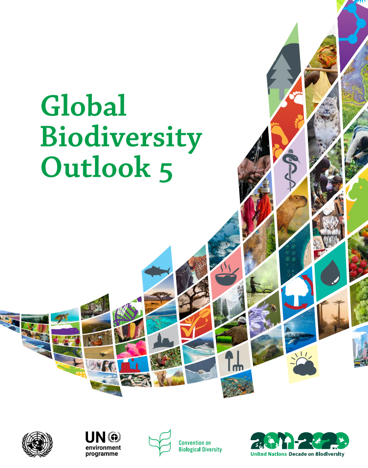
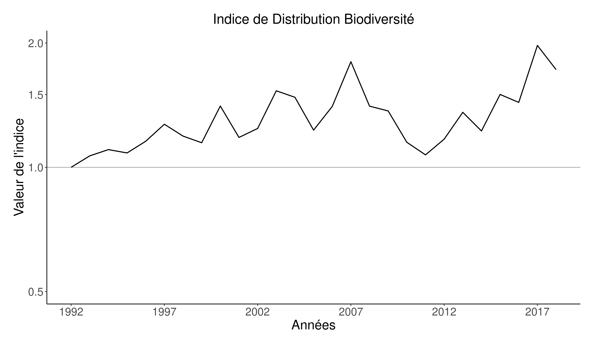

```{r setup, echo = F}
knitr::opts_chunk$set(
  comment = "#",
  #cache = TRUE,
  collapse = TRUE,
  warning = FALSE,
  message = FALSE,
  fig.width = 7,
  fig.height = 5.25,
  fig.align = 'center',
  fig.retina = 3
)

# base plot layout
mypar = list(mar = c(3,3,0.5,0.5), mgp = c(1.5, 0.3, 0), tck = -.008)

# xaringan Extra
xaringanExtra::use_xaringan_extra(c("tile_view", "animate_css", "tachyons"))
xaringanExtra::use_extra_styles(
  hover_code_line = TRUE,         #<<
  mute_unhighlighted_code = TRUE  #<<
)
xaringanExtra::use_editable(expires = 1)
xaringanExtra::use_panelset()
```
class: middle, title-slide

<!-- top logo (comment to remove or edit on `conf/css/style.css:23`) -->
<div class="lab-logo"></div>
<div class="uni-logo"></div>

# Indice Distribution Biodiversité

<hr width="60%" align="left" size="1" color="orange"></hr>

## Suivre les changements d'aire <br/> de distribution au fil du temps

### Vincent Bellavance, .small[étudiant à la maîtrise]

<div class="birds" >Photo by <a href="https://unsplash.com/@patriceb?utm_source=unsplash&utm_medium=referral&utm_content=creditCopyText" class="link_birds" >Patrice Bouchard</a> on <a style="font-size:10px;" href="https://unsplash.com/?utm_source=unsplash&utm_medium=referral&utm_content=creditCopyText" class="link_birds">Unsplash</a></div>
  


<br><br>
[<i class="fa fa-github fa-lg" style="color:#e7e8e2"></i> VincentBellavance/seminar2](https://github.com/VincentBellavance/seminar2)

[<i class="fa fa-twitter fa-lg" style="color:#e7e8e2"></i> @v_bellavance](https://twitter.com/v_bellavance)


---
# Changements de biodiversité
<hr width="100%" align="left" size="1" color="orange"></hr>

.pull-left[
  
]

--

<br><br>

.pull-right[
.font120[**Déclins:**]

.font120[
- Destruction d’habitats
- Surexploitation
- Pollution
- Introduction d’espèces exotiques
- Changements climatiques
]
]

---
# Changements de biodiversité
<hr width="100%" align="left" size="1" color="orange"></hr>

.pull-left[
  
]

--

<br><br>

.pull-right[
  
]

???

La production de ces deux rapports a accéléré le développement d'indicateurs de biodiversité entamé lors des deux dernières décennies.

---

# Changements de biodiversité
<hr width="100%" align="left" size="1" color="orange"></hr>

.pull-left[
  
]

<br><br>

.pull-right[
  
]

---
# Les indicateurs de biodiversité
<hr width="100%" align="left" size="1" color="orange"></hr>

<br>

.center[
  
]

???

Les indicateurs font parties des outils qui servent à mesurer les changements de biodiversité.

---

# Les indicateurs de biodiversité
<hr width="100%" align="left" size="1" color="orange"></hr>

<br>

.center[
  
]

???

Ils servent à représenter les changements de manière simplifiée

---

# Les indicateurs de biodiversité
<hr width="100%" align="left" size="1" color="orange"></hr>

<br>

.pull-left1[
  .center2[
    <br>
    
  ]
]

.pull-right1[
.font120[
- Compréhensible

<br>
- Communicable

<br>
- Mesure précise

]
]

???

Ils servent à représenter les changements de manière simplifiée

---

# Développement d'indicateurs
<hr width="100%" align="left" size="1" color="orange"></hr>

.pull-left[
  <br><br>
  .center2[
    
  ]
]

--

.pull-right[
  <br>
  
]

???

Un indicateur peut représenter plusieurs thèmes. Le thème ayant le plus développé en terme de nombre d'indicateurs est définitivement celui des espèces. 

---

# Indice Planète Vivante
<hr width="100%" align="left" size="1" color="orange"></hr>

.font120[
- Mesure le changement moyen de la taille des populations de vertébrés depuis 1970
]

--

.font120[
- Utilise les suivis de population à long terme:
  - Mesure **directe ou indirecte** 
  - Sur **plusieurs années** 
  - **Même méthodologie** pour une population
]

--

.font120[
- Peut-être calculer **globalement**, pour une **région précise** ou pour un **groupe taxonomique**
]

---
# Méthodes du LPI
<hr width="100%" align="left" size="1" color="orange"></hr>

<br>

.pull-left[
  .center[
  .font120[
    **Données d'abondance**
  ]
  ]

  
]

--

.pull-right[
  .center[
  .font120[
    **Tendance modélisée avec GAM**
  ]
  ]

  
]

---

# Méthodes du LPI
<hr width="100%" align="left" size="1" color="orange"></hr>

<br>

.pull-left[
.font120[
- Permet d'avoir des tendances de populations **non-linéaires**

<br>

- Permet d'avoir des **valeurs de taille de poulation** pour les **années sans données** 
]
]

.pull-right[
  .center[
  .font120[
    **Tendance modélisée avec GAM**
  ]
  ]

  
]

---
# Méthodes du LPI
<hr width="100%" align="left" size="1" color="orange"></hr>

<br>

.font120[
  - Ramène la tendance de population avec la première année à 1
]

<br>

.font120[
  - On inclut les autres populations en faisant une moyenne des tendances de chaque population pour chaque année
]

---

# Le LPI au niveau global
<hr width="100%" align="left" size="1" color="orange"></hr>

<br>

.center[
  
]

---

# Le LPI au niveau global
<hr width="100%" align="left" size="1" color="orange"></hr>

<br>

.center[
  
]

---

# Critiques du LPI
<hr width="100%" align="left" size="1" color="orange"></hr>

<br>

.center[
  
]

---

# Critiques du LPI
<hr width="100%" align="left" size="1" color="orange"></hr>

<br>

.center[
  
]

---

# Le LPI au Canada
<hr width="100%" align="left" size="1" color="orange"></hr>

.font120[**Indice planète vivante**]

<br>

.center[
  
]

.cite[WWF Canada [2020]]

---

# Le LPI au Canada
<hr width="100%" align="left" size="1" color="orange"></hr>

.font120[**Indice des espèces canadiennes**]

<br>

.center[
  
]

.cite[Environnement Canada [2019]]

---

# Oiseaux
<hr width="100%" align="left" size="1" color="orange"></hr>

<br>

.center[
  
]

---

# Les suivis de biodiversité au Québec
<hr width="100%" align="left" size="1" color="orange"></hr>

<br>

- .font120[Orientation du gouvernement]

>.font120[**Évaluation** de la **biodiversité** et **élaboration** d’un **réseau de suivi**]

--

- .font120[**Aucun suivi** de biodiversité à **long terme**]

--

- .font120[Nécessité d'avoir des indicateurs de biodiversité afin que le Québec respecte ses engagements]

???

C'est important d'avoir ce genre de suivi, surtout que l'évaluation de la biodiversité et l'élaboration d'un réseau de suivi de la biodiversité fait partie des orientation du gouvernement en matière de biodiversité. 

---

# Limites du LPI
<hr width="100%" align="left" size="1" color="orange"></hr>

<br>

.font120[
  - Suivis de populations difficiles à obtenir
]

--

.font120[
  - N'est pas spatial (changements peuvent avoir une certaine structure spatiale)
]

--

.font120[
  - On en peut voir que les changements nets (**montrer la figure**)
]

???

Les données sont un problème lorsque vient le temps de calculer l'indicateur dans une province comme le Québec

---

# Objectifs
<hr width="100%" align="left" size="1" color="orange"></hr>

<br>

>.font120[
  .center[**Développer un indicateur de changement de biodiversité basé sur les données d'occurrences**]
]

--

<br>

>.font120[
  .center[**Documenter les changements d'aires de distribution des espèces présentes au Québec**]
]

--

<br>

>.font120[
  .center[**Comparer les changements de biodiversité de divers groupes taxonomiques**]
]

---

class: middle, center, inverse

# Méthodes
<hr width="100%" align="left" size="1" color="orange"></hr>

---

# Méthodes
<hr width="100%" align="left" size="1" color="orange"></hr>

.center[]

---

# Méthodes
<hr width="100%" align="left" size="1" color="orange"></hr>

.center[]

???

Base de données commencé en 2019, toujours en développement, notamment pour ce qui est de la validation des données et de la taxonomie, et de l'injection de données. 

---

# Méthodes
<hr width="100%" align="left" size="1" color="orange"></hr>

.center[]

.div-top[
.font120[
  - **Standard d'informations** pour les observations sur la biodiversité au Québec
]

.font120[
- Proviennent de **plusieurs sources**:
  - Gouvernementales
  - Bases de données ouvertes (e.g. GBIF)
  - Science citoyenne (e.g. eBird)
]

.font120[
  - 130 millions d'occurrences de plusieurs centaines d'espèces
]
]

---

# Méthodes
<hr width="100%" align="left" size="1" color="orange"></hr>

.center[]

---

# Méthodes
<hr width="100%" align="left" size="1" color="orange"></hr>

.center[
  
]

.center[
  
]

---

# Méthodes
<hr width="100%" align="left" size="1" color="orange"></hr>

.center[
  
]

.center[
  
]

---

# Méthodes
<hr width="100%" align="left" size="1" color="orange"></hr>

.center[
  
]

.pull-left-top[
.font120[
- eBird

- Atlas des Oiseaux Nicheurs

- Relevé des Oiseaux Nicheurs
]
]

.pull-right[
  
]

---

# Méthodes
<hr width="100%" align="left" size="1" color="orange"></hr>

.center[
  
]

.pull-left-top[
.font120[
- eBird

- Atlas des Oiseaux Nicheurs

- Relevé des Oiseaux Nicheurs

- Près de **huit millions** de points d'échantillonnages **exhaustifs** **(1990 à 2020)**
]
]

.pull-right[
  
]

---

# Méthodes
<hr width="100%" align="left" size="1" color="orange"></hr>

.center[
  
]

.div-top[

.font120[
  - Modèle suppose qu'il y a équilibre entre espèce et environnement. On souhaite voir les changements d'aires de distribution causées par les changements d'environnement. 
]

<br>

.font120[
  - On veut décrire la dfistribution de l'espèce et non modéliser l'habitat disponible de l'espèce
]

<br>

.font120[
  - Donc, on veut utiliser l'espace et le temps
]
]

---

# Méthodes
<hr width="100%" align="left" size="1" color="orange"></hr>

.center[
  
]

.div-top[
  .font120[
    **Autocorrélation spatiale**
  ]
]

.center[
  
]

---

# Méthodes
<hr width="100%" align="left" size="1" color="orange"></hr>

.center[
  
]

.div-top[
  .font120[
    **Autocorrélation spatiale**
  ]
]

.center[
  
]

---

# Méthodes
<hr width="100%" align="left" size="1" color="orange"></hr>

.center[
  
]

.div-top[
  .font120[
    **Autocorrélation spatiale**
  ]
]

.center[
  
]

---

# Méthodes
<hr width="100%" align="left" size="1" color="orange"></hr>

.center[
  
]

.div-top[
  .font120[
    **Autocorrélation spatiale**
  ]
]

.center[
  
]

---

# Méthodes
<hr width="100%" align="left" size="1" color="orange"></hr>

.center[
  
]

.div-top[
  .font120[
    **Lisser distribution dans le temps**
  ]
]

.center[
  
]

--

<br>

.div-top[
.font120[
  > **Équivalent du GAM pour le LPI**
]
]

---

# Méthodes
<hr width="100%" align="left" size="1" color="orange"></hr>

.center[]

---

# Méthodes
<hr width="100%" align="left" size="1" color="orange"></hr>

.center[]

.div-top[
.center[
  
]
]

---

# Méthodes
<hr width="100%" align="left" size="1" color="orange"></hr>

.center[]

<br>

.div-top[
.center[
  
]
]

---

# Méthodes
<hr width="100%" align="left" size="1" color="orange"></hr>

.center[]

<br>

.div-top[
.center[
  
]
]

---

# Méthodes
<hr width="100%" align="left" size="1" color="orange"></hr>

.center[]

.div-top[
.center[
  
]
]

---

# Méthodes
<hr width="100%" align="left" size="1" color="orange"></hr>

.center[]

.div-top[
  .center[
    
  ]
]

---

# Méthodes
<hr width="100%" align="left" size="1" color="orange"></hr>

.center[]

.div-top[
  .center[
    
  ]
]

---

# Méthodes
<hr width="100%" align="left" size="1" color="orange"></hr>

.center[]

.div-top[
  .center[
    
  ]
]

---

# Méthodes
<hr width="100%" align="left" size="1" color="orange"></hr>

.center[]

.div-top[
  .center[
    
  ]
]

---

# Méthodes
<hr width="100%" align="left" size="1" color="orange"></hr>

.center[]

.font120[
  - Visualiser expansion/contraction de l'aire de distribution pour chaque cellule
]

<br>

.font120[
  - Permet de voir les changements sur l'ensemble du territoire
]

---

class: middle, center, inverse

# Résultats
<hr width="100%" align="left" size="1" color="orange"></hr>

---

# Résultats
<hr width="100%" align="left" size="1" color="orange"></hr>

.center[
  
]

---

# Résultats
<hr width="100%" align="left" size="1" color="orange"></hr>

.center[
  
]

---

# Résultats
<hr width="100%" align="left" size="1" color="orange"></hr>

.center[
  
]

---

# Résultats
<hr width="100%" align="left" size="1" color="orange"></hr>

.center[
  
]

---

# Résultats
<hr width="100%" align="left" size="1" color="orange"></hr>

.center[
  
]

---

# Discussion
<hr width="100%" align="left" size="1" color="orange"></hr>

.font120[
- Les augmentations plus faciles à visualiser que les contractions (agrégation des données?)
]

.font120[
  - Certains modèles ne convergent pas
]

.font120[
- Pratiquement pas d'informations au nord
  - Calculer l'indice seulement pour le sud du Québec?
  - Ajouter données de modèles d'experts
  - Doit avoir une incertitude
]

---

# Discussion
<hr width="100%" align="left" size="1" color="orange"></hr>

<br>

- L'utilisation des SDMs permet d'avoir une incertitude plus "réaliste" que l'incertitude de lPI:
  - Incertitude sur la moyenne
  - Incertitude sur le modèle:
    - biais d'obs / détection (science citoyenne)
    - enviro
    - paramétrisation du modèle
    - processus (random pop fluctuations)

---

# Conclusion
<hr width="100%" align="left" size="1" color="orange"></hr>

<br>

Indicateurs qui utilisent aires de distribution

- On peut observé les changements brutes (expansion/contraction)
- L'indice peut être spatialisé

- Permettrait de faire des prédictions sur l'indicateur dans le temps:
  - Scénario de changements climatiques ou d'utilisation du territoire
  - Important dans l'optique d'avoir des objectifs de conservation de la biodiversité
